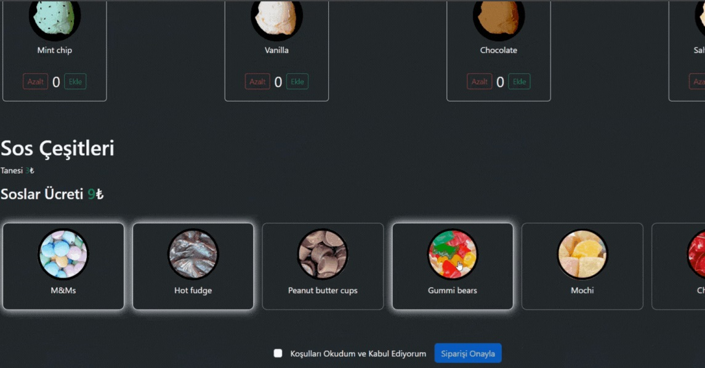
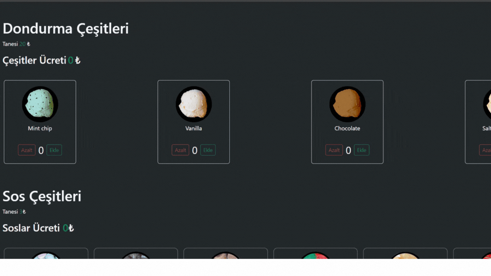

# Firebase_Chat_App

This project is a React-based web application where users can view various ice cream flavors and toppings, add them to the cart, and manage their orders. Users can edit or remove items, view prices, and control the total cost. The application features responsive design using Bootstrap and includes unit tests with Jest and React Testing Library to ensure component functionality and reliability.

# Tools and Libraries Used

- json-server
- bootstrap
- @testing-library/user-event@14.0
- axios@^0.27.2

# Screenshots

## Gif

